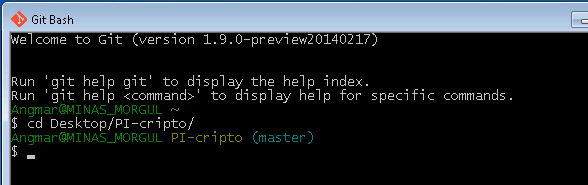

# Bash-Prompt

Bash é um interpretador de comandos, normalmente conhecido como shell.  
É o shell utilizado pelo **Git Bash**, no Windows.

Aqui estão algumas modificações na configuração padrão para melhorar a
usabilidade da linha de comando.

**bashrc** acrescenta ao prompt o *branch* atual quando em um projeto git. Em
outras pastas a informação é oculta. Faz uso do script, executado internamente,
**git\_prompt**

**inputrc**  contém configurações para facilitar a busca de comandos no
histórico com as setas do teclado. Ex.: ao digitar `git s` e usar a seta para
cima, os comandos mostrados serão apenas os que começam com `git s` ao invés de
mostrar os últimos comandos digitados.

# Exemplo

Para mudarem as cores e/ou informações antes do *branch*, dois links com tudo que
precisam para customizar seu shell.

[Color Codes][color]  
[Prompt Escapes][escapes]

# Instalação

O modo mais fácil de colocar os arquivos lugar certo é usando o Git Bash.  
Navegue até esta pasta usando

    cd [caminho da pasta]
    
e execute os seguintes comandos:

    cp bashrc ~/.bashrc
    cp inputrc ~/.inputrc
    cp git_prompt ~/.git_prompt

Execute agora

    source ~/.bashrc
    
e veja o prompt atualizar com a informação nova do seu projeto Git.

# Fontes

git\_prompt foi retirado dos [arquivos-fonte do Git][source] com uma pequena
alteração na linha 279 para retirar um espaço.

[color]: https://wiki.archlinux.org/index.php/Color_Bash_Prompt#List_of_colors_for_prompt_and_Bash
[escapes]: https://wiki.archlinux.org/index.php/Color_Bash_Prompt#Prompt_escapes
[source]: https://github.com/git/git/blob/master/contrib/completion/git-prompt.sh
